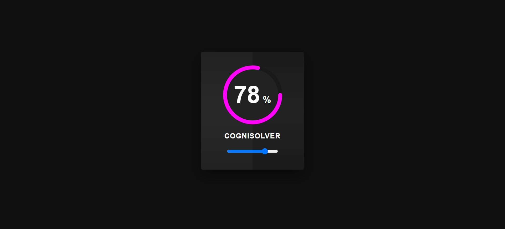

# Circular Progress Bar

A simple web-based circular progress bar with interactive percentage control. This project demonstrates the creation of a circular progress bar using HTML, CSS, and JavaScript.

## Demo : [Launch Project](https://cognisolver.github.io/circular-progress-bar/)


## Features

- Circular progress bar with customizable percentage.
- Interactive slider to control the progress percentage.
- Smooth hover effects on the progress bar card.
- Responsive design for various screen sizes.

## Installation

1. Clone the repository to your local machine:

   ```bash
   git clone https://github.com/cognisolver/circular-progress-bar.git
   ```

2. Open the `index.html` file in your web browser to view the project locally.

## Usage

1. Open the project in your web browser.
2. Use the slider to adjust the progress percentage.
3. The circular progress bar and percentage value will update dynamically.

Feel free to incorporate this circular progress bar into your own projects by copying the relevant HTML, CSS, and JavaScript code.

## Contributing

Contributions to this project are welcome. If you have any suggestions, improvements, or bug fixes, please open an issue or create a pull request.

## License

This project is licensed under the MIT License - see the [LICENSE](LICENSE) file for details.
